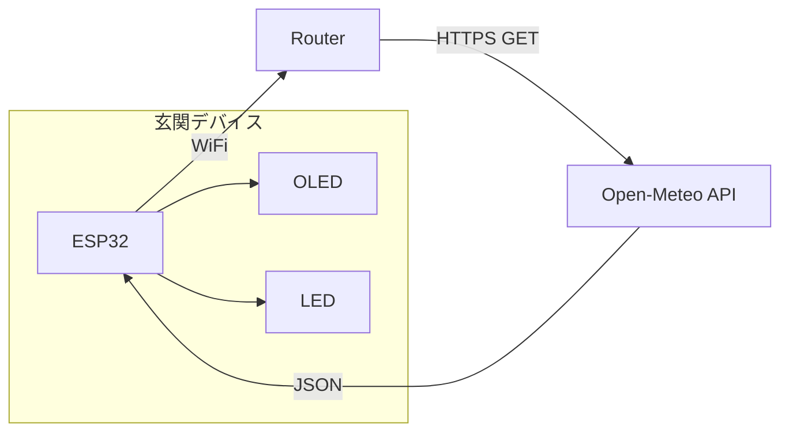

# KasaAlert プロジェクト設計書

## プロジェクト名

| 項目 | 内容 |
|------|------|
| **正式名** | KasaAlert（カサアラート） |
| **リポジトリ名** | `kasa-alert` |
| **副題** | ESP32 玄関用 傘忘れ防止デバイス |

### 名前の意図

- **Kasa**（傘）+ **Alert**（注意喚起）で目的が一目でわかる
- 英語圏でも読めるが、日本語の「傘」に由来する音を含む
- 短くて GitHub リポジトリ名としても扱いやすい

### 代替案（参考）

| 名前 | 備考 |
|------|------|
| RainDoor | 玄関 × 雨。シンプル |
| KasaWatch | 雨を監視して傘を促す |
| UmbrellaGuard | 英語のみで意味が明確 |

---

## 1. 背景・目的

### 課題

雨の日に傘を忘れて外出し、帰り道や目的地で困ることがある。

### 解決策

玄関に常設する小型デバイスが、朝や外出前に「今日は雨」と視覚的に伝える。

### 設計方針

- **雨の日だけ目立つ** — 毎日点灯していると気づかなくなる
- **静音優先** — ブザーは朝にうるさい。LED + 表示が主信号
- **常時 USB 給電** — 玄関に置きっぱなし
- **個人情報を送らない** — 位置は緯度・経度のみ

---

## 2. システム構成



### データフロー

1. 起動時に WiFi 接続
2. 天気 API へ HTTPS GET（今日の weathercode 等）
3. JSON をパースし雨判定
4. OLED / LED で状態表示
5. 3〜6 時間ごとに再取得（API 負荷・WiFi 節約）

---

## 3. ハードウェア

### 購入済み

ESP32 SuperKit 系（ELEGOO / Freenove / Keyestudio 等の総合キット）

### キットに含まれる想定部品と用途

| 部品 | 傘プロジェクトでの用途 |
|------|------------------------|
| ESP32 DevKit | メイン（WiFi・API 取得） |
| 0.96" OLED（SSD1306）または LCD1602 | 「☔ 傘を持って！」表示 |
| LED（赤・黄・緑など） | 雨の日の注意（青があれば青が最適） |
| 抵抗（220Ω〜330Ω） | LED 用 |
| タクトスイッチ | 手動で天気再取得など |
| ブザー | 雨の日アラート（任意・朝はうるさい） |
| DHT11 | 温湿度表示の拡張用 |
| RGB LED | 天気で色分け（青＝雨、黄＝曇、緑＝晴） |
| ブレッドボード・ジャンパー線 | 配線 |
| USB ケーブル | 給電・書き込み |

> メーカーにより同梱品は異なる。OLED の有無で表示方式が変わる。

### 推奨構成（最小）

```
ESP32 ── I2C ── OLED（天気・傘メッセージ）
ESP32 ── GPIO ── LED（雨の日だけ点滅）
ESP32 ── USB 給電
```

### キットを活かした推奨構成

| 天気 | OLED | LED |
|------|------|-----|
| 晴れ | 薄表示 or 消灯 | 消灯 |
| 曇り | 「曇り」 | 黄（弱め） |
| 雨 | 「☔ 傘！」 | 点滅 |

RGB LED がある場合:

| 天気 | RGB の色 |
|------|----------|
| 晴れ | 緑（弱め） |
| 曇り | 黄 |
| 雨 | 青（点滅） |

### 配線（OLED I2C 4pin の一般的な例）

| OLED | ESP32 |
|------|-------|
| GND | GND |
| VCC | 3.3V |
| SDA | GPIO 21（多くの ESP32 でデフォルト） |
| SCL | GPIO 22 |

| LED | ESP32 |
|-----|-------|
| アノード（長い脚）→ 抵抗 220Ω → GPIO（例: 2） |
| カソード（短い脚）→ GND |

> キット付属チュートリアルのピン配置を優先すること。I2C ピンはキットによって異なる場合がある。

### 玄関設置の実用 Tips

| 項目 | 対応 |
|------|------|
| 給電 | USB ケーブル + スマホ充電器（5V 1A 以上） |
| ケース | 最初はブレッドボードのまま。動作確認後にプラケース |
| WiFi | 玄関は電波が弱いことがある → 要確認 |
| 9V 電池ホルダー | キットに付属する場合あり。常時表示は USB 給電が楽 |

---

## 4. 天気 API

### 推奨: Open-Meteo（無料・API キー不要）

```
https://api.open-meteo.com/v1/forecast?latitude=35.68&longitude=139.76&daily=weathercode&timezone=Asia/Tokyo
```

- 緯度・経度で指定（東京例: 35.68, 139.76）
- `weathercode` で雨判定（WMO コード）
- 商用利用は要確認（個人趣味の範囲では一般的に問題ない）

### 代替: OpenWeatherMap

- 無料枠あり（API キー必要、1 日 1,000 回程度）
- 日本語ドキュメントが豊富

### 上級者向け: 気象庁

- 無料・高精度だが XML/JSON の構造が複雑
- 初回実装は Open-Meteo で十分

### 雨判定（WMO weathercode）

```cpp
bool isRainy(int code) {
  return (code >= 51 && code <= 67) ||  // 霧雨・雨
         (code >= 80 && code <= 82) ||  // にわか雨
         (code >= 95 && code <= 99);     // 雷雨
}
```

---

## 5. ソフトウェア

### 開発環境

- **PlatformIO**（VS Code / Cursor）または **Arduino IDE**

### 依存ライブラリ（予定）

| ライブラリ | 用途 |
|------------|------|
| WiFi / HTTPClient | ESP32 標準。WiFi 接続・HTTP 取得 |
| ArduinoJson | JSON パース |
| Adafruit SSD1306 + Adafruit GFX | OLED 表示 |
| WiFiManager（任意） | 初回のみ SSID 設定 |

### 動作ロジック

1. **起動時**: WiFi 接続（`WiFiManager` で初回だけ SSID 設定も可）
2. **API 取得**: 今日の `weathercode` を取得
3. **判定**:
   - 雨コード → LED 点滅 + OLED「☔ 傘を持って！」
   - 曇り → 「曇り」表示のみ
   - 晴れ → 消灯 or 薄表示
4. **定期更新**: 3〜6 時間ごとに再取得
5. **朝の強調**（オプション）: 6〜8 時は雨なら点滅を強める

---

## 6. 実装ステップ

キット付属チュートリアルとの対応:

| 段階 | 内容 | キットサンプル相当 | 確認方法 |
|------|------|-------------------|----------|
| 1 | ESP32 + WiFi 接続 | WiFi 接続 | Serial に IP 表示 |
| 2 | API 取得 | — | Serial に JSON 出力 |
| 3 | JSON パース・雨判定 | — | Serial に `RAIN: true` |
| 4 | OLED 表示 | OLED 表示 | 天気アイコン表示 |
| 5 | LED 点滅（雨のみ） | LED 点滅 | 実機テスト |
| 6 | ケース・玄関設置 | — | 実運用 |

> いきなり全部を 1 本のコードにまとめず、段階ごとに動作確認すること。

---

## 7. 拡張アイデア（将来）

- 明日の雨も表示（「明日も雨」）
- Home Assistant 連携（MQTT）
- ボタン 1 つで詳細表示（最高気温・降水確率）
- E-Paper ディスプレイ（常時表示でも目立たない）
- ArduinoOTA による無線アップデート

---

## 8. 未確定事項・確認リスト

実装前に確認が必要な項目:

- [ ] キットの型番・メーカー
- [ ] ディスプレイの種類（0.96" OLED / LCD1602 / その他）
- [ ] 開発環境（Arduino IDE / PlatformIO）
- [ ] 設置場所の緯度・経度
- [ ] 玄関の WiFi 電波状況

---

## 9. 変更履歴

| 日付 | 内容 |
|------|------|
| 2026-06-27 | 初版作成（設計・キット選定まで） |
